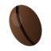

# ARABICA — Antigravity Coffee Shop Website

A single-page coffee-house site built around the supplied 3D animated
scene. Glassmorphism ("liquid glass") panels float over the looping video,
with coffee beans, warm drops and steam suspended mid-air and drifting on
a pointer-driven parallax.

Static HTML with a **pre-compiled** Tailwind CSS v4 stylesheet. No build
step needed to view it, and no runtime JavaScript for styling.

## Running it

Open `index.html` in a browser, or serve it:

```bash
npm run serve        # http://localhost:8080
```

> Some browsers block autoplay on `file://`. If the hero looks static,
> serve it over http with the command above.

## Editing styles

```bash
npm install          # once
npm run build        # one-off, minified
npm run dev          # rebuild on save
```

`assets/css/site.css` is committed so the site works from a clean clone.
Rebuild after changing any Tailwind class.

## Structure

```
index.html
assets/
  css/site.css              # compiled Tailwind (committed)
  js/site.js                # menu, video control, parallax, form
  video/
    hero.mp4                # 872 KB — H.264, audio stripped, faststart
    hero.webm               # 823 KB — VP9, preferred when supported
  img/
    hero-poster.jpg         # first paint before the video is ready
    bean.svg, bean-light.svg
    drop.svg, steam.svg
    favicon.svg
src/input.css               # Tailwind entry + design tokens
```

## How the antigravity layer works

All floating pieces live in one `#ag-layer` container that is
`aria-hidden="true"` with `pointer-events: none` — it is decoration and
must never intercept a click or reach a screen reader.

Each element carries its own timing and travel through CSS custom
properties, so nothing moves in lockstep:

```html

```

- `--dur` / `--delay` — cycle length and phase offset
- `--dy` / `--dx` — how far it travels
- `--spin` / `--twist` — resting rotation and how much it turns
- `data-ag` — **parallax depth.** 0.3 is the far layer, 1.15 the nearest.

Animations use `transform` and `opacity` only, so they stay off the layout
path. Parallax writes to the `translate` property, which composes with the
keyframe `transform` rather than overwriting it — that is why the drift
keeps running while the pointer moves.

Parallax is skipped on touch-only devices (no hovering pointer to track).

## Swapping the video

Replace both files in `assets/video/` and regenerate the poster. Keeping
both formats matters: WebM is smaller where supported, MP4 covers Safari.

```bash
ffmpeg -i your.mp4 -an -vf scale=1600:-2 -c:v libx264 -crf 27 \
  -preset slow -pix_fmt yuv420p -movflags +faststart hero.mp4
ffmpeg -i your.mp4 -an -vf scale=1600:-2 -c:v libvpx-vp9 -crf 36 \
  -b:v 0 -row-mt 1 hero.webm
ffmpeg -ss 0.4 -i your.mp4 -frames:v 1 -vf scale=1600:-2 -q:v 4 \
  ../img/hero-poster.jpg
```

`-an` strips audio: a background video must be silent, and muted audio is
required for autoplay anyway.

**If your footage is brighter than this one, re-check the scrim.** The
whole legibility argument below rests on measurements of *this* video.

## Accessibility

The hard problem here is light text over moving video. It was solved by
measurement, not by eye — see `design-system/` notes in the commit history
for the full working.

- **Palette sampled from the video itself.** Dominant hues all land at
  14–23°; the amber accent is taken from the wall lamp's glow.
- **Panels are dark glass, not translucent white.** Over a dark video,
  white glass lightens a panel *toward* the backdrop and collapses text
  contrast on bright frames. Dark glass at 70% does the opposite.
- **Contrast verified against real rendered pixels across the whole
  10-second loop**, sampling 8 frames and taking the worst case:

  | Region | Colour | Worst across loop |
  |---|---|---|
  | H1 headline | cream-50 | 15.55:1 |
  | Body paragraph | cream-200 | 12.00:1 |
  | Nav links | cream-200 | 11.67:1 |
  | Glass panel body | cream-200 | 6.76:1 |
  | Glass panel muted | cream-300 | 5.01:1 |
  | Prices on glass | amber-500 | 4.91:1 |

- **Amber takes dark text, never white.** `#F0A64B` with espresso text is
  9.34:1; white on it is 2.05:1 and fails.
- **`prefers-reduced-motion` is fully honoured**: the video never starts,
  every float stops, and parallax is not wired up at all. Verified in a
  browser with the preference set.
- **The looping video has an explicit pause control**, because
  auto-playing moving content needs a stop affordance. It stays reachable
  while the video is on screen and retires once the hero scrolls away.
- Skip link as first tab stop; visible amber focus ring on everything;
  one `<h1>`; no heading-level skips; all inputs labelled; pointer targets
  ≥24×24 px; no horizontal scroll at 375 / 768 / 1024 / 1440 px.
- The reservation form validates on blur, wires each message to its field
  with `aria-describedby` + `aria-invalid`, and focuses a linked error
  summary after a failed submit.

## Before going live

1. **The reservation form has no backend.** `assets/js/site.js` fakes the
   submit with a `setTimeout`. A guest would see "Table requested" and no
   request would reach anyone. Wire it to a real endpoint first.
2. **All content is placeholder** — the ARABICA name, the address on
   Rasheed Street, the `+962` number, prices in JOD, and both quotes.
   Update `index.html` *and* the `CafeOrCoffeeShop` JSON-LD in `<head>`.
3. Set `<link rel="canonical">` and `og:url`.
4. Paste a Google Maps embed into the map panel.
5. Confirm you hold the rights to the hero footage before publishing.

## License

Placeholder content; no license asserted.
